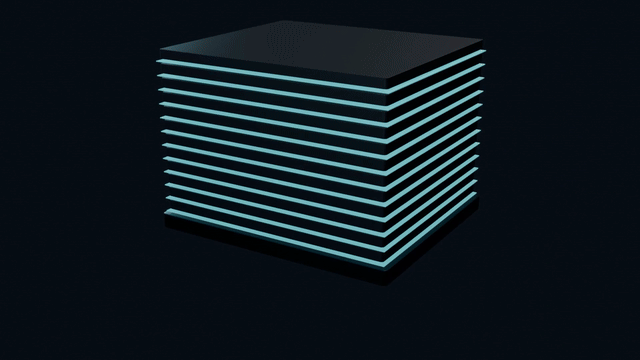

# popsci-3d-explainer

**A complete pipeline for producing 10–25 minute landscape 3D science explainer videos with headless Blender**, packaged as a Claude Code skill.
Final script → TTS → word-level alignment → 3D shots rendered so each animation lands on the frame its keyword is spoken → chapter HUD → mix → per-shot review.

Built for "open it up and show how it works" topics: hardware, semiconductors, machines, physical mechanisms.
Not meant for vertical quick-cut videos or stock-footage montages.

Two finished films were made with it (in Chinese): *SSD* (9:47) and *DRAM & HBM* (22 min, 108 shots, ~38k frames).
Every 3D shot is modeled and rendered by Python scripts in Blender; *Memory & HBM* uses no external footage beyond its own data cards and one benchmark clip.

> The skill documents, comments and log messages are in Chinese. The scripts themselves are plain Python.

---

## Preview

**40-second clip from *Memory & HBM*** (in Chinese; voice-over, subtitles, chapter HUD, progress bar and BGM all come from the pipeline's final pass)

https://github.com/user-attachments/assets/924b2fcf-5adb-4524-aea1-05327c4e5e0d

**Full films on Bilibili** (click a cover)

<table>
<tr>
<td width="50%"><a href="https://www.bilibili.com/video/BV1gdYr6QEMg/"></a></td>
<td width="50%"><a href="https://www.bilibili.com/video/BV135Yu6hEbH/"></a></td>
</tr>
<tr>
<td align="center"><i>Memory &amp; HBM</i> · 22:36</td>
<td align="center"><i>How an SSD works</i> · 9:48</td>
</tr>
</table>

The GIFs below are silent clips from the films.




**Beat-driven**: voice-over and word timestamps come first; each visual element appears when its word is spoken.


---

## Pipeline

One hard rule: **sound first, picture second.** The timeline comes from the voice-over, not from storyboard estimates.

| # | Step | Command | Gate |
|---|---|---|---|
| 1 | Write narration + storyboard | edit `scenes.py` | 150–620 chars per segment; ≤16 chars per block |
| 2 | Regenerate script doc | `python gen_gao.py` | — |
| 3 | Script grid + lint | `python grid_script.py --lint` | filler phrases / breath groups / first use of terms |
| 4 | Storyboard gate | `python check_scenes.py` | CHECK_OK: script and storyboard match char-for-char |
| 5 | Build storyboard.json | `python make.py storyboard` | always first after editing the script |
| 6 | TTS | `python chain.py tts` | wav count == segment count |
| 7 | Audio chain | `python chain.py audio` | insert pauses → word alignment → beats |
| 8 | Write shots | edit `bl_shots.py` | `python check_beats_kw.py` → KW_OK |
| 9 | Render | `python chain.py render` | disk-space gate; no `LABEL_` in logs |
| 10 | Assemble | `python bgm.py scan` / `mix <seconds>` → `python chain.py post` | cover + subtitles + chapter cards / HUD / progress bar + BGM |
| 11 | Review | `python grid.py` + `python verify.py` | all three grids stamped + VERIFY_OK |

Subtitle or music-only changes: `python final_pass.py final` (~1 min) or `remix` (~15 s).

Details, criteria and every silent failure we hit are in `skills/popsci-3d-explainer/reference/00–08`.

---

## Install

```bash
git clone https://github.com/L-Trunks/popsci-3d-explainer.git
cd popsci-3d-explainer
bash install.sh            # Windows: powershell -ExecutionPolicy Bypass -File install.ps1
```

Installs into `~/.claude/skills/`; `--project` (`-Project` on Windows) installs into the current project only.
Without Claude, run the eleven steps in `SKILL.md` by hand.

## Start a film

```bash
python ~/.claude/skills/popsci-3d-explainer/new_film.py path/to/my-film "Title"
cd path/to/my-film
# edit config.json: blender path, tts backend, fonts
python config.py
```

The engine is **copied** into the film directory, not referenced — every film ends up editing its own parts library and shots.
The templates contain a minimal 2-segment, 4-shot example that runs from step 2 to step 10 once `config.json` is set.

## Requirements

| | |
|---|---|
| Blender 4.5+ | EEVEE Next, command line `-b` only |
| ffmpeg / ffprobe | on PATH |
| Python 3.10+ | `pip install numpy soundfile pillow jieba pypinyin edge-tts faster-whisper` |
| Optional | `librosa` (BGM scoring), `matplotlib` (benchmark charts) |
| Optional voice | edge-tts by default (free); [VoxCPM](https://github.com/OpenBMB/VoxCPM) for local voice cloning — pitfalls documented at the top of `tts_voxcpm.py` |
| GPU | 12 GB VRAM is enough |
| Disk | ~32 GB of frames for a 20-minute film |

Developed and tested on **Windows 11**. For Linux/macOS, change font paths and Blender candidates (see the end of `00-配置与依赖.md`).

## Acknowledgements

- https://github.com/Vincentwei1021/anything2explainer

## License

Code (`scripts/`, `templates/`, `new_film.py`, install scripts): MIT. Documents (`SKILL.md`, `reference/`, READMEs, `docs/`): CC BY 4.0. See [LICENSE](LICENSE).

Author: 特兰克斯 ([@L-Trunks](https://github.com/L-Trunks))
